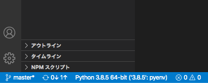
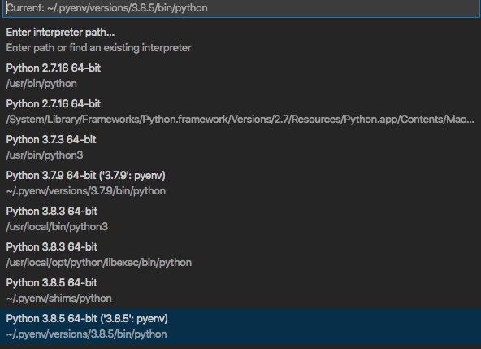

# pyenvの設定


[pyenvを使ってMacにPythonの環境を構築する](https://qiita.com/1000ch/items/93841f76ea52551b6a97)
参照。

ちょっとハマったら
[pyenvのインストール、使い方、pythonのバージョン切り替えできない時の対処法](https://qiita.com/koooooo/items/b21d87ffe2b56d0c589b)
参照。


```zsh
cd ~
git clone https://github.com/pyenv/pyenv.git ~/.pyenv
```

2020/08/25時点での最新安定版をインストール
```zsh
pyenv install 3.8.5
```

特に指定していないときは、3.8.5を使う
```zsh
pyenv global 3.8.5
```


特定のディレクトリ配下に移動して、実行するとそのディレクトリ向けのバージョンを指定できる  
```zsh
cd <your_directory>
pyenv local 3.7.9
```
特にこだわりがなければ、このコマンドを指定せず。
 ``` pyenv global  ``` で指定したバージョンをそのまま使っていいと思います。  
pyenv localで指定したバージョンは、
<your_directory>/.python-version ファイルに記載されています。


### 実際に使われているPythonのパスの確認

```zsh
python
```

interpreterが起動するので、以下をコピペしてください。
```
import sys 
sys.exec_prefix
sys.executable
```

### VSCodeで使うPythonのpath設定

vscodeの設定で、Python XXXXX のところをクリック してください。



install されているpythonの一覧が出ます。


先程確認した
pythonのインストールディレクトリを選択してください。

git cloneした場合は、 ``` $HOME/.vscode/settings.json ``` で
下記を設定済みです。
```
"python.pythonPath": "~/.pyenv/versions/3.8.5/bin/python",
```
